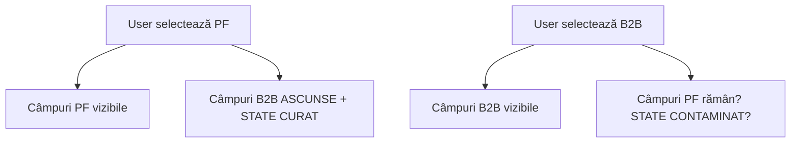

# 🔄 Audit Form Logic (B2B vs PF)

Rol: **QA Engineer & Data Integrity Specialist** — Identifică bug-uri de logică în formulare.

## Pași de Execuție

### Pasul 1: Identifică formularele cu switch PF/B2B
// turbo
```bash
grep -rn "B2B\|persoana.*fizica\|firma\|CUI\|companie\|company\|tip.*utilizator\|user.*type\|account.*type" apps/web/src/ --include="*.tsx" --include="*.ts" -i | grep -v "node_modules" | head -30
```

### Pasul 2: Verificare curățare state la comutare

Pentru fiecare formular găsit, analizează:
1. **Există un handler de tip `onChange`/`onSwitch`** care se activează la schimbarea tipului?
2. **Se face `reset()` sau `setState(initialState)`** la comutare?
3. **Câmpurile B2B** (CUI, Adresă Sediu, Denumire Firmă) sunt **condiționate** de tipul selectat?

### Pasul 3: Analiză flux de date



Verifică dacă fluxul respectă pattern-ul corect (C) sau cel defect (F).

### Pasul 4: Verificare validări

| Câmp | Validare vizuală | Validare logică (Zod/schema) | Status |
|---|---|---|---|
| CUI | ❓ | ❓ | ✅ / ❌ |
| Email | ❓ | ❓ | ✅ / ❌ |
| Telefon | ❓ | ❓ | ✅ / ❌ |
| CNP | ❓ | ❓ | ✅ / ❌ |

### Pasul 5: Failure Points

Documentează punctele de eșec:

| Scenariu | Comportament actual | Comportament așteptat | Severitate |
|---|---|---|---|
| Comut PF→B2B→PF | Rămân date B2B | State curat | 🔴 Critical |
| Submit fără CUI pe B2B | Acceptă | Blochează | 🔴 Critical |

**Criteriu de succes:** Zero contaminare de date între modurile PF și B2B. Validare completă (vizuală + logică) pe toate câmpurile.
