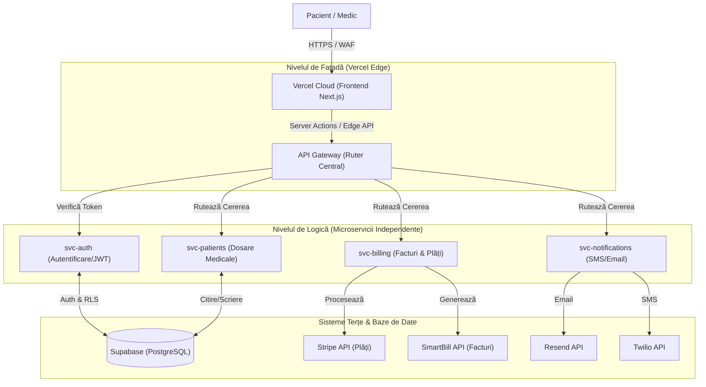
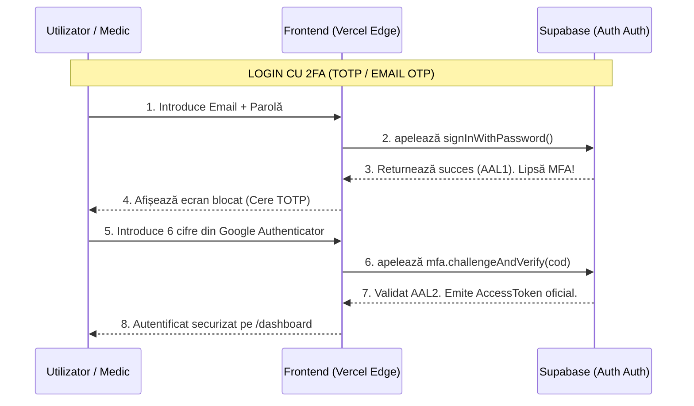
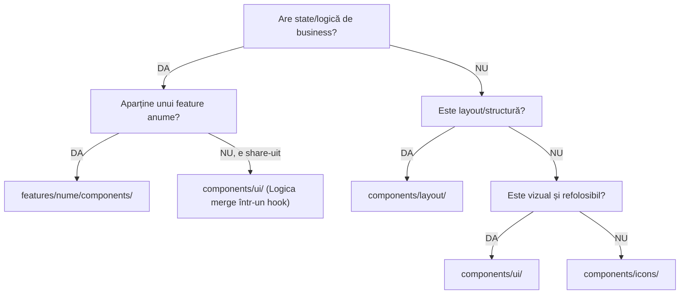
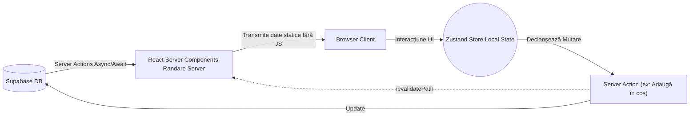
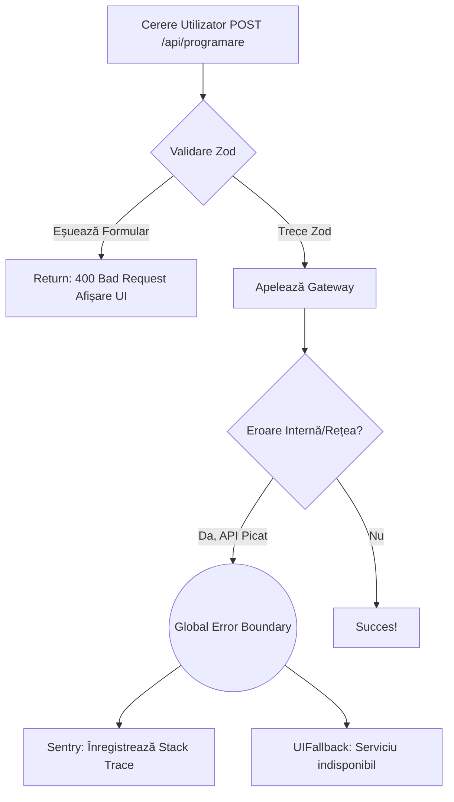
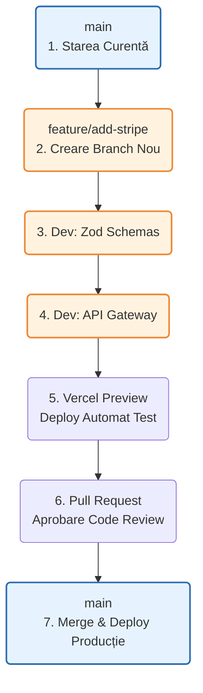

# 🏛️ MEDELISE MASTER ARCHITECTURE BIBLE
**SURSA UNICĂ DE ADEVĂR PENTRU ECOSISTEMUL MEDELISE**

> **Versiune:** 2.0 (Consolidată) | **Ecosistem:** SpheraOS / careOS  
> **Scop:** Acest document unifică arhitectura sistemului, protocoalele de securitate, matematica de design și regulile de frontend (FSD). Nicio linie de cod nu se scrie fără a respecta aceste legi.

---

## 🧭 CUPRINS
1. [Infrastructură & Monorepo (Microservicii)](#1-infrastructur-monorepo-microservicii)
2. [Securitate, Complianță & Autentificare](#2-securitate-complian-autentificare)
3. [Arhitectura Frontend (Feature-Sliced Design)](#3-arhitectura-frontend-feature-sliced-design)
4. [Fundația Matematică de Design (UI)](#4-fundaia-matematic-de-design-ui)
5. [Sistemul de Assets & Nomenclatură](#5-sistemul-de-assets-nomenclatur)
6. [Guvernanță & Definition of Done](#6-guvernan-definition-of-done)

---

## 🌐 1. INFRASTRUCTURĂ & MONOREPO (Microservicii)

Backend-ul **nu** este un monolit. Proiectul folosește un `pnpm`/`npm` workspace orchestrat prin Turborepo sau Nx, bazat pe servicii *Plug-and-Play* decuplate.

### 1.1 Diagrama Ecosistemului Cloud-Native



### 1.2 Regulile Monorepo-ului (Izolare)
*   **A. Structura fizică:** Frontend-ul se află în `apps/web/`. Microserviciile în `apps/api/` (sau `apps/svc-*`). Schemele Zod partajate în `packages/shared/`.
*   **B. Fără 'Shared Databases':** `svc-billing` NU are voie să citească direct tabela pacienților din baza de date a `svc-patients`. Interogarea se face prin API-ul intern.
*   **C. Comunicare inter-servicii:** Declanșată prin Evenimente (Webhooks / RabbitMQ). (ex: *Pacient creat* -> *Trimite SMS bun venit*).

---

## 🔐 2. SECURITATE, COMPLIANȚĂ & AUTENTIFICARE

Aplicația tratează date medicale (PHI), deci securitatea este la standard **AAL2 (Authenticator Assurance Level 2)** pentru respectarea HIPAA & GDPR.

### 2.1 Fluxul MFA (Multi-Factor Authentication) cu Supabase



### 2.2 Securitatea pe Straturi
*   **Zero FOUC (Flashes of Unauthenticated Content):** Verificarea JWT-ului se face prin Middleware Next.js la nivel de margine de rețea (Vercel Edge). Timp de răspuns < 50ms pentru redirectări fără ecran alb.
*   **Fără Parolă (OTP Login):** Pacienții se pot loga pur și simplu introducând telefonul și primind un SMS OTP valabil 5 minute (`signInWithOtp()`).
*   **Protecție Formulare:** Orice date pleacă din UI trec prin `packages/shared/validations/auth.schema.ts` (Zod). 

---

## 🧩 3. ARHITECTURA FRONTEND (Feature-Sliced Design)

Medelise folosește module absolut izolate. Tot codul ce are logică de business trăiește în `src/features/`.

### 3.1 Matricea de Importuri (Zero Excepții)

```text
                     POATE IMPORTA DIN →
                ┌────────┬──────────┬────────────┬────────┬──────┐
     DIN ↓      │ app/   │features/ │components/ │shared/ │ lib/ │
┌───────────────┼────────┼──────────┼────────────┼────────┼──────┤
│ app/          │   —    │    ✅    │     ✅     │   ✅   │  ✅  │
│ features/X    │   ❌   │   ⚠️¹    │     ✅     │   ✅   │  ✅  │
│ components/   │   ❌   │    ❌    │     ✅²    │   ❌³  │  ✅  │
│ shared/       │   ❌   │    ❌    │     ❌     │   ✅   │  ✅  │
└───────────────┴────────┴──────────┴────────────┴────────┴──────┘
```
*   ¹ `features/X` importă din `features/Y` DOAR prin `index.ts` (Barrel Export). Fără legături interne invizibile.
*   ² Componentele interne (`components/ui`) sunt „atomi puri”. Nu apelează hooks (`useCart`), nu au logică de business, nu scriu de domeniu.

### 3.2 Diagrama de Triaj a Componentelor



---

## 📐 4. FUNDAȚIA MATEMATICĂ DE DESIGN (UI)

Aplicația vizuală se bazează pe rigoare matematică. `globals.css` este singura sursă de adevăr.

### 4.1 Regula Zero și Culorile
*   **Base Unit:** `:root { --base-unit: 4px; }`. Toate formele și spațierile sunt multipli de `4px` (preferabil de `8px`).
*   **Culori Stricte:**
    *   `--color-primary (#213170)`: Indigo (Logouri, Headings, Call to Action).
    *   `--color-accent (#FE5D16)`: Orange (Exclusiv accente vizuale, eyebrows. NICIODATĂ CTA principal).
    *   `--color-secondary (#BDE0FF)`: Baby Blue (Text luminos pe fundal Indigo).
    *   Nu există hardcodare hexadecimală (`#FFF`) în modulele React; totul e instanțiat cu `var(--color-*)`.

### 4.2 Scala Fluidă de Tipografie și Layout
*   Folosim `clamp()` – Mărimile fontului și spațierea secțiunilor se scalează algoritmic între Mobile (375px) și Desktop (1065px+). **Fără tailwind breakpoints (`md:`, `lg:`)** pentru texte.
*   **Fonturi Alocate:**
    *   `Michroma`: Exclusiv Logo / Wordmarks.
    *   `Montserrat`: Toate Hedings (`<h2>`, `<h3>`, etc).
    *   `Inter`: Body text.

---

## 📦 5. SISTEMUL DE ASSETS & NOMENCLATURĂ

### 5.1 Protocolul WebP (Foldere /public)
Zero imagini PNG, JPEG sau fișiere SVG uriașe nerefacute. Tot mediul grafic este compus din `.webp`.
```text
public/
├── brand-medelise/      → (md-logo-black.webp)
├── icons-medelise/      → Peste 1.000 iconițe pe categorii (md-ico-doc.webp).
└── images-medelise/     → Imagini HD per features (md-img-hero-intro.webp).
```
Asset-urile din `icons-` și `images-` **trebuie** trecute prin filtrele `@shared/constants/icons.ts` sau hardcodate limitativ doar în feature-ul de care aparțin.

### 5.2 Standarizarea Numelor de Fișiere
| Element | Formulare | Exemplu |
|---------|-----------|---------|
| Componente React | PascalCase | `AppointmentCard.tsx` |
| Hooks | camelCase | `usePatientData.ts` |
| Interfețe/Types TS | PascalCase prefixate | `interface IVPatientProfile` |
| Config & Fisiere utils | camelCase | `formatDate.ts`, `turbo.json` |

---

## ✅ 6. GUVERNANȚĂ & DEFINITION OF DONE

Înainte ca un cod să poată fi aprobat și împins spre serverele de producție de către un dezvoltator (sau agent AI), trebuie să valideze 5 Piloni:

1.  **Fără Rute de Import Murdare:** Niciun import din `src/features/*` care nu folosește alias-ul oficial (`@features/...`) sau ignoră arhitectura de Barrels (`index.ts`).
2.  **Date Separate de Logică:** Secret-keys (Stripe, Twilio) trăiesc doar în `.env` în folder-ul de microserviciu (Backend). 
3.  **Fără Imagini Directe:** Totul este importat prin `next/image` cu atribute exprese de optimizare (lățime, înălțime) spre a evita Core Web Vitals CLS.
4.  **Cod Validat prin Zod:** Niciun flux Input/Output nu scapă de validarea Schemelor TypeScript cross-workspace.
5.  **Reverificarea Contextelor (reguli-stricte.md):** Fiecare folder static nou creat va poseda un `reguli-stricte.md` cu detalierea și inventarierea fișierelor sale.

**[End of Master Architecture Document]**

---

## 💾 7. STRATEGIA DE DATA FETCHING & STATE MANAGEMENT

Fluxul datelor trebuie să fie previzibil. Interzicem folosirea excesivă a Redux sau Context API (Prop Drilling) în favoarea arhitecturii moderne Next.js + Zustand.

### 7.1 Ciclul de Viață al Datelor (Diagrama de Flux)



### 7.2 Reguli de State Management
1.  **Server State (Supabase):** Rânduit EXCLUSIV prin **React Server Components (RSC)**. Nu aducem liste de pacienți folosind `useEffect` sau `useQuery` pe client. Totul vine pre-randat HTML de la Vercel.
2.  **Client State (UI, Modaluri, Coș de cumpărături):** Folosim **Zustand**. Este un store global, minimalist, care nu provoacă re-randări întregii aplicații când se schimbă un singur `boolean`.
3.  **Mutarea Datelor (Formulare):** Modificarea bazei de date se face via **Server Actions** (`"use server"`). Frontend-ul apelează o funcție, iar Vercel Edge o execută securizat. După o plată de succes, se apelează `revalidatePath('/dashboard')` pentru a aduce instant datele noi.

---

## 💥 8. ERROR HANDLING & OBSERVABILITY

Platforma medicală nu are voie să afișeze ecrane albe (White Screen of Death) sau erori criptice pacienților (ex: `Error 500: Database timeout`).

### 8.1 Arhitectura de Tratare a Erorilor (Global Error Boundaries)



### 8.2 Contractul Universal de Răspuns (API Response Pattern)
Toate microserviciile Medelise comunică spre Frontend folosind **UN SINGUR CONTRACT JSON**:
```json
// Răspuns de SUCCES
{
  "success": true,
  "data": { "patientId": "uuid-1234", "status": "confirmed" }
}

// Răspuns de EROARE (Gestionat grațios)
{
  "success": false,
  "error": {
    "code": "PAYMENT_FAILED",
    "message": "Cardul a fost respins. Vă rugăm verificați fondurile."
  }
}
```
*   **Observabilitate (Sentry):** Orice eroare neașteptată (`throw new Error`) ajunge în Sentry. Este **STRICT INTERZIS** să lăsăm date sensibile (`email`, `cnp`) în logurile Sentry. Folosim doar UUID-uri pentru depanare.

---

## 🗄️ 9. MODELAREA DATELOR (Database Schema Protocol)

Baza de date (Supabase PostgreSQL) are propriul ei guvernământ.
1.  **Nomenclatură:** Obligatoriu `snake_case` (ex: `first_name`, `appointment_date`). Niciodată `firstName`.
2.  **Identificatori (Primary Keys):** Folosim EXCLUSIV **UUID v4**. (ex: `f47ac10b-58cc-4372-a567-0e02b2c3d479`). Dacă am folosi ID-uri numerice (1, 2, 3), hackerii ar putea itera peste ele. UUID face imposibilă ghicirea URL-urilor medicale.
3.  **Istoric Incoruptibil (Soft Deletes):** Niciun rând din baza de date Medicală nu se șterge prin comanda SQL `DELETE`. Adăugăm mereu funcția de **Soft Delete**: `deleted_at = NOW()`. Aceasta filtrează datele din UI, dar le păstrează pentru audit legislativ sau facturare istorică.

---

## 🚀 10. CI/CD & ECOSISTEM DE LUCRU (Github Flow)

Pentru echipele de Top 0.1%, codul ajunge de la laptop-ul programatorului pe serverul Medelise printr-o autostradă complet automatizată și testată.

### 10.1 Calea Codului spre Producție



### 10.2 Reguli de Integrare
*   **Main Branch Protection:** Nimeni, nici măcar arhitectul principal, nu face "push direct" pe `main`. Se folosesc Pull Requests.
*   **Vercel Preview Deployments:** La fiecare Pull Request, Vercel generează automat un URL temporar secret (ex: `stripe-test-medelise.vercel.app`). Clientul sau QA-ul testează vizual schimbarea. Abia după validare udamă, codul este acceptat.
*   **Turborepo Smart Caching:** Dacă se face un commit doar într-un fișier de Backend (`svc-billing`), Turborepo ignoră instalarea și testarea ramurii `apps/web` pe Github Actions, scurtând timpul de build de la 10 minute la 30 de secunde.

---

## 🧪 11. STRATEGIA DE TESTARE (The Testing Pyramid)

Nu există cod de nivel medical fără 3 straturi de testare matematică. Nimic nu trece de CI/CD dacă testele pică.

1.  **Unit Tests (Vitest):** Mici, rapide (milisecunde). Testează funcții matematice izolate și scheme Zod. (ex: *CalculeazăCorectTVA(100) -> 119*).
2.  **Integration Tests:** Verifică legăturile. (ex: *Dacă trimit payload bun spre svc-auth, primesc înapoi JWT valid?*).
3.  **E2E (End-to-End cu Playwright):** Cireașa de pe tort. Un robot de test zilnic pornește un browser Chromium fantomă, se duce pe platforma ta, dă click pe "Programare", alege data, completează numele, simulează o plată Stripe și verifică dacă a primit bifa verde. Dacă robotul nu prinde bifă într-o noapte, la ora 04:00, ești alertat automat pe telefon că un update recent a stricat ceva critic.
