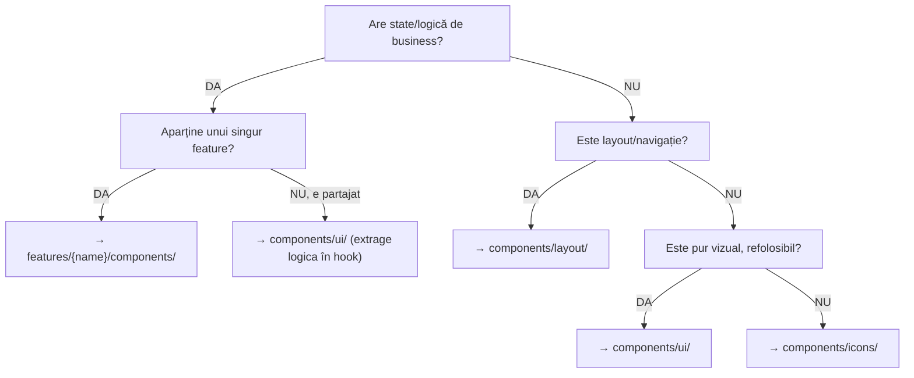
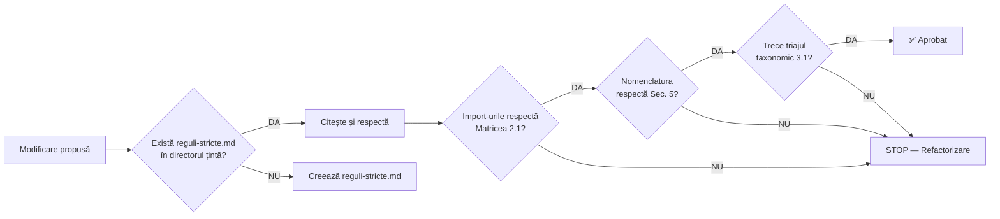

# MEDELISE-ARCHITECTURE-RULES.md
## Sursa Unică de Adevăr — Arhitectura Medelise

> **Versiune:** 1.0 | **Dată:** 2026-02-18 | **Autor:** Principal Software Architect Audit  
> **Scop:** Documentul acesta guvernează ORICE modificare adusă codului Medelise. Niciun fișier nou, nicio mutare, nicio refactorizare nu se face fără consultarea acestui document.

---

## 1. AUDIT DE DEPENDENȚE (Cross-Reference Findings)

### 1.1 Statistici generale

| Metric | Valoare |
|---|---|
| Total fișiere proiect | 1,342 |
| Total linii cod componente | 19,180 |
| Total importuri mapate | 211 |
| Importuri `@/` (alias) | 80+ |
| Importuri relative `./` | 70+ |
| Căi hardcodate către assets | 70+ |
| Componente > 500 linii | 10 |

### 1.2 Violări de Graniță Identificate

> [!CAUTION]
> Aceste 3 importuri traversează granițe de feature și trebuie rezolvate în migrare:

| Fișier | Import ilegal | Tip |
|---|---|---|
| `services/DeshidratareContent.tsx` | `from '../contact/ContactFormSection'` | Feature→Feature direct |
| `services/IVDripProductPage.tsx` | `from '../TestimonialsSection'` | Feature→Homepage direct |
| `services/IVDripProductPage.tsx` | `from '../ui/Button'` | Feature→UI (relativ, nu alias) |

**Soluții la migrare:**
- `ContactFormSection` → se extrage în `components/ui/` ca form-component reutilizabil SAU se importă prin barrel `@features/contact`
- `TestimonialsSection` → se extrage în `components/ui/` (nu e legat de homepage, e reutilizabil)
- `Button` → se importă obligatoriu prin `@ui/Button`, niciodată relativ

### 1.3 Patternuri de Asset Path

| Pattern | Ocurențe | Exemplu |
|---|---|---|
| Constants registry (`ICONS.x`, `IMAGES.x`) | ~20 | `src={IMAGES.hero.background}` |
| Inline `src=` hardcodat | ~35 | `src="/images-medelise/md-iv-drip/..."` |
| CSS `mask-image` / `url()` | ~8 | `maskImage: "url('/icons-medelise/...')"` |
| Inline SVG data URI | 2 | `background-image: url("data:image/svg+xml,...")` |

### 1.4 Top 10 Componente după Complexitate

| # | Component | Linii | Feature |
|---|---|---|---|
| 1 | `ApplicationFormContent.tsx` | 1,078 | cariera |
| 2 | `CardScanner.tsx` | 924 | auth |
| 3 | `ApplicationJourney.tsx` | 857 | cariera |
| 4 | `DocumentChecker.tsx` | 808 | cariera |
| 5 | `Step1_DatePersonale.tsx` | 776 | cariera |
| 6 | `RegisterForm.tsx` | 699 | auth |
| 7 | `IVDripProductPage.tsx` | 593 | iv-therapy |
| 8 | `CarieraContent.tsx` | 571 | cariera |
| 9 | `TestimonialsSection.tsx` | 508 | homepage* |
| 10 | `PatientPortalSection.tsx` | 506 | homepage |

> \* `TestimonialsSection` este utilizat și de `iv-therapy` → candidat pentru extragere în `components/ui/`

---

## 2. PROTOCOLUL DE IMPORT (Dependency Rules)

### 2.1 Matricea de Acces

```
                     POATE IMPORTA DIN →
                ┌────────┬──────────┬────────────┬────────┬──────┐
     DIN ↓      │ app/   │features/ │components/ │shared/ │ lib/ │
┌───────────────┼────────┼──────────┼────────────┼────────┼──────┤
│ app/          │   —    │    ✅    │     ✅     │   ✅   │  ✅  │
│ features/     │   ❌   │   ⚠️¹   │     ✅     │   ✅   │  ✅  │
│ components/   │   ❌   │    ❌    │     ✅²    │   ❌³  │  ✅  │
│ shared/       │   ❌   │    ❌    │     ❌     │   ✅   │  ✅  │
│ lib/          │   ❌   │    ❌    │     ❌     │   ❌   │  ✅  │
└───────────────┴────────┴──────────┴────────────┴────────┴──────┘
```

> [!IMPORTANT]
> **¹ Feature→Feature:** DOAR prin `index.ts` barrel export. Niciodată import direct de fișier intern.  
> **² components/ intern:** `ui/` nu importă din `layout/`. `layout/` poate importa din `ui/`.  
> **³ Exception:** `components/layout/` poate importa din `shared/constants` și `shared/data/navigation` — sunt date de navigație pure.

### 2.2 Reguli Absolute (Zero Excepții)

1. **`@ui/*` nu importă niciodată din `@features/*`** — atomii sunt puri vizual
2. **`@features/X` nu importă fișiere interne din `@features/Y`** — doar barrel
3. **Importurile de assets se fac EXCLUSIV prin constantele din `@shared/constants/`** SAU inline direct în proprietarul componentei
4. **Niciun import circular** — detectat automat cu `madge`
5. **Alias-uri obligatorii** pentru orice import cross-directory:
   ```typescript
   // ✅ CORECT
   import Button from '@ui/Button';
   import { ICONS } from '@shared/constants/icons';
   
   // ❌ INTERZIS
   import Button from '../ui/Button';
   import { ICONS } from '../../constants/icons';
   ```

### 2.3 Alias-uri TypeScript

```json
{
  "paths": {
    "@/*": ["./src/*"],
    "@features/*": ["./src/features/*"],
    "@ui/*": ["./src/components/ui/*"],
    "@layout/*": ["./src/components/layout/*"],
    "@shared/*": ["./src/shared/*"],
    "@lib/*": ["./src/lib/*"]
  }
}
```

---

## 3. TAXONOMIA COMPONENTELOR

### 3.1 Criterii de Triaj



### 3.2 Definițiile Nivelurilor

| Nivel | Locație | Ce conține | Reguli |
|---|---|---|---|
| **Atom** | `components/ui/` | Button, Badge, Input, Spinner, StatCard, FeatureCard | Zero import din features. Zero import din shared/data. Props-only. Fără `useContext`. |
| **Icon** | `components/icons/` | Componente icon wrapper (MailIcon) | SVG inline sau wrapper img. Fără state. |
| **Organism** | `components/layout/` | Navbar, Footer, Container, Section, NewsTicker | Poate importa din `ui/` și `shared/`. Include state de navigație. |
| **Feature Module** | `features/{name}/` | Componente cu business logic, data, hooks, context | Self-contained. Comunică cu exterior DOAR prin barrel `index.ts`. |

### 3.3 Regula "Hook = Feature"

> **Dacă o componentă folosește `useContext`, `useReducer` cu logică de business, sau importă date specifice unui domeniu → aparține obligatoriu unui `features/`.**

Exemple:
- `IVDripCatalog` importă `IV_DRIP_SERVICES` → `features/iv-therapy/`
- `LoginForm` gestionează auth state → `features/auth/`
- `Button` primește doar props vizuale → `components/ui/`

---

## 4. PROTOCOLUL DE ASSETS (All-WebP & Namespace)

### 4.1 Structura Obligatorie `/public`

```
public/
├── brand-medelise/      → Logo-uri, wordmark-uri
├── icons-medelise/      → 15 subdirectoare, 1,072 iconițe WebP
│   ├── md-system/
│   ├── md-medical/
│   ├── md-buildings/
│   ├── ... (15 total)
│   └── reguli-stricte.md
├── images-medelise/     → 10 subdirectoare, fotografii/mockup-uri
│   ├── md-hero/
│   ├── md-iv-drip/
│   ├── ... (10 total)
│   └── reguli-stricte.md
└── favicon.webp
```

### 4.2 Nomenclatura Assets

| Tip | Pattern | Exemplu |
|---|---|---|
| Logo/Brand | `md-logo-{variant}.webp` | `md-logo-icon-indigo.webp` |
| Iconiță | `md-ico-{descriptor}.webp` | `md-ico-heart-pulse.webp` |
| Imagine | `md-img-{context}-{descriptor}.webp` | `md-img-drip-beauty.webp` |

### 4.3 Reguli de Referențiere

1. **Iconițe de navigație/UI** → referite prin `@shared/constants/icons.ts`
2. **Imagini de conținut** → referite prin `@shared/constants/images.ts`
3. **Imagini specifice unui feature** → hardcodate DOAR în feature-ul proprietar
4. **CSS mask-image** → permis DOAR cu cale absolută `url('/icons-medelise/...')`
5. **Nu se folosesc data URI pentru SVG** → se convertesc la WebP sau se creează componentă icon

### 4.4 Sistemul de Guvernanță per Director

Fiecare subfolder din `/public` conține un `reguli-stricte.md` cu:
- **Scop** — ce tip de fișiere aparțin
- **Nomenclatură** — pattern-ul obligatoriu
- **Registru** — tabel complet cu fiecare fișier și rolul lui
- **Reguli de actualizare** — cine și cum modifică

---

## 5. STANDARDE DE NOMENCLATURĂ (Naming Convention)

### 5.1 Fișiere

| Tip | Convention | Exemplu |
|---|---|---|
| Componentă React | PascalCase | `HeroSection.tsx` |
| Hook | camelCase, prefix `use` | `useAuth.ts` |
| Constantă/Date | camelCase | `ivDripServices.ts` |
| Tip TS | camelCase (fișier), PascalCase (export) | `types.ts` → `export type IVDripProduct` |
| Barrel export | fix | `index.ts` |
| Governance | fix | `reguli-stricte.md` |
| Util/Lib | camelCase | `cn.ts`, `analytics.ts` |

### 5.2 Componente React

```typescript
// ✅ CORECT
export default function HeroSection() { ... }  // PascalCase, default export
export function StatCard({ ... }: StatCardProps) { ... }  // Named export OK

// ❌ INTERZIS
export default function heroSection() { ... }  // camelCase
export const hero_section = () => { ... }      // snake_case
```

### 5.3 Tipuri TypeScript

```typescript
// ✅ Prefix cu context
export interface IVDripProductProps { ... }
export type IVClinicalStudy = { ... }
export interface StepProps { ... }

// ❌ Fără prefix generic
export interface Props { ... }  // prea vag
export type Data = { ... }     // zero context
```

### 5.4 Directoare features/

| Regulă | Format | Exemplu |
|---|---|---|
| kebab-case | `features/{feature-name}/` | `features/iv-therapy/` |
| Subdirectoare standard | `components/`, `data/`, `hooks/`, `types/`, `context/` | fix |

---

## 6. SISTEMUL DE BARREL EXPORTS

### 6.1 Metodologie

Fiecare modul feature **TREBUIE** să aibă un `components/index.ts` care e Public API-ul:

```typescript
// features/iv-therapy/components/index.ts

// ── Public Components ──
export { default as IVDripCatalog } from './IVDripCatalog';
export { default as IVDripProductPage } from './IVDripProductPage';
export { default as ServiceCard } from './ServiceCard';

// ── Public Types ──
export type { IVDripProductProps } from './iv-drip/types';
export type { IVClinicalStudy } from './clinical/types';
```

### 6.2 Reguli

1. **Doar barrel poate fi importat din exterior:**
   ```typescript
   // ✅ CORECT (din app/ pages)
   import { IVDripCatalog } from '@features/iv-therapy/components';
   
   // ❌ INTERZIS
   import IVDripCatalog from '@features/iv-therapy/components/IVDripCatalog';
   ```

2. **Importurile interne (în același feature) rămân relative:**
   ```typescript
   // Înăuntrul features/iv-therapy/
   import IVWhySection from './IVWhySection';  // ✅ OK
   ```

3. **Nu se re-exportă dependențe externe prin barrel:**
   ```typescript
   // ❌ INTERZIS
   export { Button } from '@ui/Button';  // Button nu aparține acestui feature
   ```

---

## 7. GOVERNANCE INTERROGATION SYSTEM

### 7.1 Protocolul AI/Developer

> [!IMPORTANT]
> **Orice agent AI sau developer care modifică un fișier TREBUIE să:**

```
ÎNAINTE de a modifica un fișier:
  1. CITESTE reguli-stricte.md din directorul țintă
  2. CITESTE reguli-stricte.md din directorul părinte (dacă există)
  3. CITESTE MEDELISE-ARCHITECTURE-RULES.md (acest document)
  4. VERIFICĂ Matricea de Import (Secțiunea 2.1)
  5. VERIFICĂ Taxonomia (Secțiunea 3.1 — diagrama de triaj)

DACĂ fișierul nou/modificat:
  - Nu respectă nomenclatura → STOP, corectează
  - Introduce un import interzis → STOP, refactorizează
  - Referă un asset fără a fi în registrul reguli-stricte.md → STOP, actualizează registrul
  - E o componentă și nu trece triajul din 3.1 → STOP, mută în locul corect
```

### 7.2 Cascada de Verificare



### 7.3 Interogarea fișierelor .md locale

Când un agent trebuie să adauge un fișier într-un director:

1. **Listează** conținutul directorului
2. **Deschide** `reguli-stricte.md` din acel director
3. **Verifică** dacă fișierul nou respectă: scop, nomenclatură, format
4. **Actualizează** registrul din `reguli-stricte.md` cu noua intrare
5. **Confirmă** că nicio regulă nu este violată

---

## 8. CHECKLIST DE VALIDARE (Definition of Done — 10 Puncte)

Orice cod nou/modificat TREBUIE să treacă **toate** cele 10 puncte:

| # | Criteriu | Cum se verifică |
|---|---|---|
| 1 | **Zero violări de import** | `grep -r "from.*features/" src/features/ \| grep -v index` returnează gol |
| 2 | **Nomenclatură corectă** | Fișier = PascalCase (.tsx) sau camelCase (.ts); Director = kebab-case |
| 3 | **Barrel export actualizat** | Noua componentă e adăugată în `index.ts` al modulului |
| 4 | **reguli-stricte.md actualizat** | Registrul include noul fișier + rol |
| 5 | **Assets doar WebP** | `find public -type f \( -name "*.png" -o -name "*.svg" -o -name "*.jpeg" \)` returnează gol |
| 6 | **Assets cu namespace** | Toate căile încep cu `md-ico-`, `md-img-`, sau `md-logo-` |
| 7 | **Build clean** | `npm run build` fără erori (excluse: erori pre-existente documentate) |
| 8 | **Zero import circular** | Verificat cu `npx madge --circular src/` |
| 9 | **Componentă în locul corect** | Trece arborele decizional din Secțiunea 3.1 |
| 10 | **Zero hardcode de asset path nou** | Căile noi de assets trec prin `@shared/constants/` sau sunt în feature-ul proprietar |

### Comanda de validare rapidă (all-in-one):

```bash
# Run this before any PR/commit:
echo "=== DoD Check ===" && \
echo "1. Cross-feature imports:" && grep -r "from.*features/" src/features/ 2>/dev/null | grep -v "index\|reguli" | wc -l && \
echo "2. Non-WebP assets:" && find public -type f \( -name "*.png" -o -name "*.svg" -o -name "*.jpeg" \) 2>/dev/null | wc -l && \
echo "3. Build:" && npm run build 2>&1 | tail -3
```

---

## 9. ERORI PRE-EXISTENTE (Documented Exceptions)

| Eroare | Locație | Status | Notă |
|---|---|---|---|
| `useCart` provider missing | `app/programare/page.tsx` | Pre-existent | CartContext nu e wrappat în layout.tsx |
| CSS `mask-image` cu WebP | `VisionSection.tsx` | Monitorizare | Funcționează în Chrome/Safari modern, necesită verificare cross-browser |

---

> [!WARNING]
> **Acest document este viu.** Se actualizează la FIECARE sprint/migrare. Versiunea din repo este sursa de adevăr, nu nicio copie locală.
